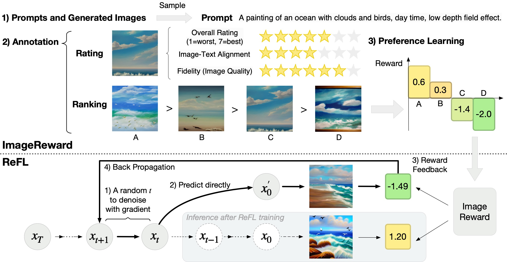
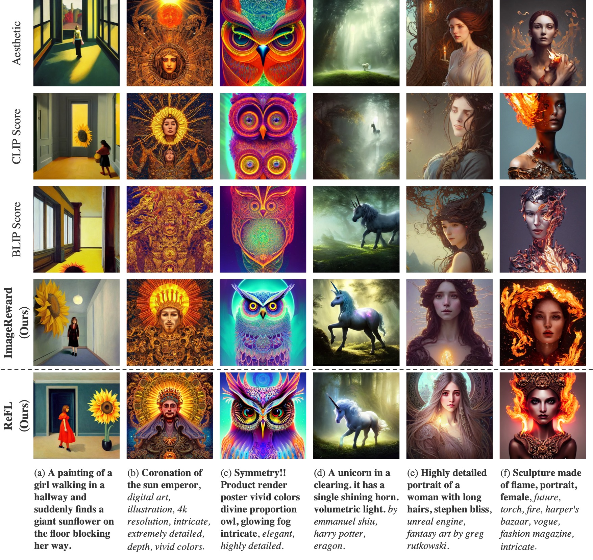
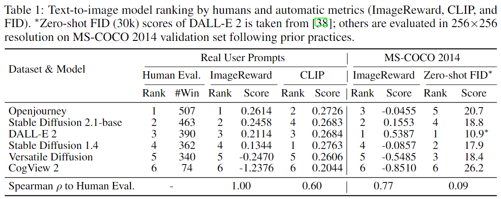
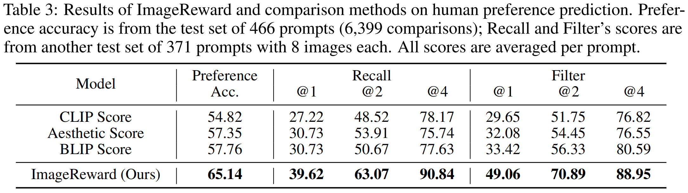

# ImageReward

<p align="center">
   📃 <a href="https://arxiv.org/abs/2304.05977" target="_blank">Paper</a> • 🖼 <a href="https://huggingface.co/datasets/THUDM/ImageRewardDB" target="_blank">Dataset</a> • 🌐 <a href="https://zhuanlan.zhihu.com/p/639494251" target="_blank">中文博客</a> • 🤗 <a href="https://huggingface.co/THUDM/ImageReward" target="_blank">HF Repo</a> • 🐦 <a href="https://twitter.com/thukeg" target="_blank">Twitter</a> <br>
</p>

🔥🔥 **News!** ```2024/12/31```: We released the **next generation of model, [VisionReward](https://github.com/THUDM/VisionReward)**, which is a fine-grained and multi-dimensional reward model for stable RLHF for visual generation (text-to-image / text-to-video)!

🔥 **News!** ```2023/9/22```: The paper of ImageReward is accepted by NeurIPS 2023!

**ImageReward: Learning and Evaluating Human Preferences for Text-to-Image Generation**

ImageReward is the first general-purpose text-to-image human preference RM, which is trained on in total **137k pairs of expert comparisons**, outperforming existing text-image scoring methods, such as CLIP (by 38.6%), Aesthetic (by 39.6%), and BLIP (by 31.6%), in terms of understanding human preference in text-to-image synthesis.

Additionally, we introduce Reward Feedback Learning (ReFL) for direct optimizing a text-to-image diffusion model using ImageReward. ReFL-tuned Stable Diffusion wins against untuned version by 58.4% in human evaluation.

Both ImageReward and ReFL are all packed up to Python `image-reward` package now!

[](https://pypi.org/project/image-reward/) [](https://pepy.tech/project/image-reward)

Try `image-reward` package in only 3 lines of code for ImageReward scoring!

```python
# pip install image-reward
import ImageReward as RM
model = RM.load("ImageReward-v1.0")

rewards = model.score("<prompt>", ["<img1_obj_or_path>", "<img2_obj_or_path>", ...])
```

Try `image-reward` package in only 4 lines of code for ReFL fine-tuning!

```python
# pip install image-reward
# pip install diffusers==0.16.0 accelerate==0.16.0 datasets==2.11.0
from ImageReward import ReFL
args = ReFL.parse_args()
trainer = ReFL.Trainer("CompVis/stable-diffusion-v1-4", "data/refl_data.json", args=args)
trainer.train(args=args)
```

If you find `ImageReward`'s open-source effort useful, please 🌟 us to encourage our following developement!

<p align="center">
    
</p>

- [ImageReward](#imagereward)
  - [Quick Start](#quick-start)
    - [Install Dependency](#install-dependency)
    - [Example Use](#example-use)
  - [ReFL](#refl)
    - [Install Dependency](#install-dependency-1)
    - [Example Use](#example-use-1)
  - [Demos of ImageReward and ReFL](#demos-of-imagereward-and-refl)
  - [Training code for ImageReward](#training-code-for-imagereward)
  - [Integration into Stable Diffusion Web UI](#integration-into-stable-diffusion-web-ui)
    - [Features](#features)
      - [Score generated images and append to image information](#score-generated-images-and-append-to-image-information)
        - [Usage](#usage)
        - [Demo video](#demo-video)
      - [Automatically filter out images with low scores](#automatically-filter-out-images-with-low-scores)
        - [Usage](#usage-1)
        - [Demo video](#demo-video-1)
      - [View the scores of images that have been scored](#view-the-scores-of-images-that-have-been-scored)
        - [Usage](#usage-2)
        - [Example](#example)
      - [Other Features](#other-features)
        - [Memory Management](#memory-management)
    - [FAQ](#faq)
  - [Reproduce Experiments in Table 1](#reproduce-experiments-in-table-1)
  - [Reproduce Experiments in Table 3](#reproduce-experiments-in-table-3)
  - [Citation](#citation)

## Quick Start

### Install Dependency

We have integrated the whole repository to a single python package `image-reward`. Following the commands below to prepare the environment:

```shell
# Clone the ImageReward repository (containing data for testing)
git clone https://github.com/THUDM/ImageReward.git
cd ImageReward

# Install the integrated package `image-reward`
pip install image-reward
```

### Example Use

We provide example images in the [`assets/images`](assets/images) directory of this repo. The example prompt is:

```text
a painting of an ocean with clouds and birds, day time, low depth field effect
```

Use the following code to get the human preference scores from ImageReward:

```python
import os
import torch
import ImageReward as RM

if __name__ == "__main__":
    prompt = "a painting of an ocean with clouds and birds, day time, low depth field effect"
    img_prefix = "assets/images"
    generations = [f"{pic_id}.webp" for pic_id in range(1, 5)]
    img_list = [os.path.join(img_prefix, img) for img in generations]
    model = RM.load("ImageReward-v1.0")
    with torch.no_grad():
        ranking, rewards = model.inference_rank(prompt, img_list)
        # Print the result
        print("\nPreference predictions:\n")
        print(f"ranking = {ranking}")
        print(f"rewards = {rewards}")
        for index in range(len(img_list)):
            score = model.score(prompt, img_list[index])
            print(f"{generations[index]:>16s}: {score:.2f}")

```

The output should be like as follow (the exact numbers may be slightly different depending on the compute device):

```
Preference predictions:

ranking = [1, 2, 3, 4]
rewards = [[0.5811622738838196], [0.2745276093482971], [-1.4131819009780884], [-2.029569625854492]]
          1.webp: 0.58
          2.webp: 0.27
          3.webp: -1.41
          4.webp: -2.03
```


## ReFL

### Install Dependency
```shell
pip install diffusers==0.16.0 accelerate==0.16.0 datasets==2.11.0
```

### Example Use

We provide example dataset for ReFL in the [`data/refl_data.json`](data/refl_data.json) of this repo. Run ReFL as following:

```shell
bash scripts/train_refl.sh
```

## Demos of ImageReward and ReFL

<p align="center">
    
</p>


## Training code for ImageReward

1. Download data: 🖼 <a href="https://huggingface.co/datasets/THUDM/ImageRewardDB" target="_blank">Dataset</a>.

2. Make dataset.
```shell
cd train
python src/make_dataset.py
```

3. Set training config: [`train/src/config/config.yaml`](train/src/config/config.yaml)

4. One command to train.
```shell
bash scripts/train_one_node.sh
```


## Integration into [Stable Diffusion Web UI](https://github.com/AUTOMATIC1111/stable-diffusion-webui)

We have developed a **custom script** to integrate ImageReward into SD Web UI for a convenient experience.

The script is located at [`sdwebui/image_reward.py`](sdwebui/image_reward.py) in this repository.

The **usage** of the script is described as follows:

1. **Install**: put the custom script into the [`stable-diffusion-webui/scripts/`](https://github.com/AUTOMATIC1111/stable-diffusion-webui/tree/master/scripts) directory
2. **Reload**: restart the service, or click the **"Reload custom script"** button at the bottom of the settings tab of SD Web UI. (If the button can't be found, try clicking the **"Show all pages"** button at the bottom of the left sidebar.)
3. **Select**: go back to the **"txt2img"/"img2img"** tab, and select **"ImageReward - generate human preference scores"** from the "**Script"** dropdown menu in the lower left corner.
4. **Run**: the specific usage varies depending on the functional requirements, as described in the **"Features"** section below.

### Features

#### Score generated images and append to image information

##### Usage

1. **Do not** check the "Filter out images with low scores" checkbox.
2. Click the **"Generate"** button to generate images.
3. Check the ImageReward at the **bottom** of the image information **below the gallery**.

##### Demo video

https://github.com/THUDM/ImageReward/assets/98524878/9d8a036d-1583-4978-aac7-4b758edf9b89

#### Automatically filter out images with low scores

##### Usage

1. Check the **"Filter out images with low scores"** checkbox.
2. Enter the score lower limit in **"Lower score limit"**. (ImageReward roughly follows the standard normal distribution, with a mean of 0 and a variance of 1.)
3. Click the **"Generate"** button to generate images.
4. Images with scores below the lower limit will be automatically filtered out and **will not appear in the gallery**.
5. Check the ImageReward at the **bottom** of the image information **below the gallery**.

##### Demo video

https://github.com/THUDM/ImageReward/assets/98524878/b9f01629-87d6-4c92-9990-fe065711b9c6

#### View the scores of images that have been scored

##### Usage

1. Upload the scored image file in the **"PNG Info"** tab
2. Check the image information on the right with the score of the image at the **bottom**.

##### Example

<p align="center">
    
</p>

#### Other Features

##### Memory Management

- ImageReward model will not be loaded **until first script run**.
- **"Reload UI"** will not reload the model nor unload it, but **reuse**s the currently loaded model (if it exists).
- A **"Unload Model"** button is provided to manually unload the currently loaded model.

### FAQ

#### How to adjust the Python environment used by the SD Web UI (e.g. reinstall a package)?

Note that **SD Web UI has two ways to set up its Python environment**:

- If you **launch with `python launch.py`**, Web UI will use the Python environment **found in your `PATH` (in Linux, you can check its exact path with `which python`)**.
- If you **launch with a script like `webui-user.bat`**, Web UI creates a new **venv environment** in the directory `stable-diffusion-webui\venv`.
    - Generally, you need some other operations to activate this environment. For example, in Windows, you need to enter the `stable-diffusion-webui\venv\Scripts` directory, run `activate` or `activate.bat` (if you are using **cmd**) or `activate.ps1` (if you are using **PowerShell**) from .
    - If you see **the prompt `(venv)` appear at the far left of the command line**, you have successfully activated venv created by the SD Web UI.

After activating the right Python environment, just do what you want to do true to form.

## Reproduce Experiments in Table 1

<p align="center">
    
</p>

**Note:** The experimental results are produced in an environment that satisfies:
- (NVIDIA) Driver Version: 515.86.01
- CUDA Version: 11.7
- `torch` Version: 1.12.1+cu113
According to our own reproduction experience, reproducing this experiment in other environments may cause the last decimal place to fluctuate, typically within a range of ±0.1.

Run the following script to automatically download data, baseline models, and run experiments:

```bash
bash ./scripts/test-benchmark.sh
```

Then you can check the results in **`benchmark/results/` or the terminal**.

If you want to check the raw data files individually:

- Test prompts and corresponding human rankings for images are located in [`benchmark/benchmark-prompts.json`](benchmark/benchmark-prompts.json).
- Generated outputs for each prompt (originally from [DiffusionDB](https://github.com/poloclub/diffusiondb)) can be downloaded from [Hugging Face](https://huggingface.co/THUDM/ImageReward/tree/main/generations) or [Tsinghua Cloud](https://cloud.tsinghua.edu.cn/d/8048c335cb464220b663/).
    - Each `<model_name>.zip` contains a directory of the same name, in which there are in total 1000 images generated from 100 prompts of 10 images each.
    - Every `<model_name>.zip` should be decompressed into `benchmark/generations/` as directory `<model_name>` that contains images.

## Reproduce Experiments in Table 3

<p align="center">
    
</p>

Run the following script to automatically download data, baseline models, and run experiments:

```bash
bash ./scripts/test.sh
```

If you want to check the raw data files individually:

* Test prompts and corresponding human rankings for images are located in [`data/test.json`](data/test.json).
* Generated outputs for each prompt (originally from [DiffusionDB](https://github.com/poloclub/diffusiondb)) can be downloaded from [Hugging Face](https://huggingface.co/THUDM/ImageReward/blob/main/test_images.zip) or [Tsinghua Cloud](https://cloud.tsinghua.edu.cn/f/9bd245027652422499f4/?dl=1). It should be decompressed to `data/test_images`.

## Citation

```
@misc{xu2023imagereward,
      title={ImageReward: Learning and Evaluating Human Preferences for Text-to-Image Generation},
      author={Jiazheng Xu and Xiao Liu and Yuchen Wu and Yuxuan Tong and Qinkai Li and Ming Ding and Jie Tang and Yuxiao Dong},
      year={2023},
      eprint={2304.05977},
      archivePrefix={arXiv},
      primaryClass={cs.CV}
}
```
