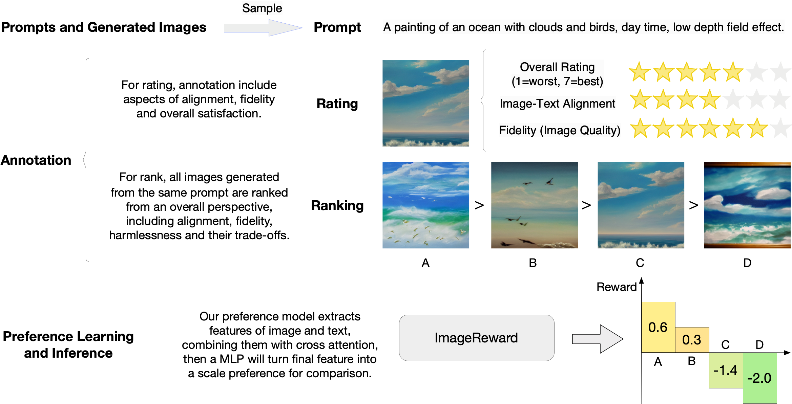
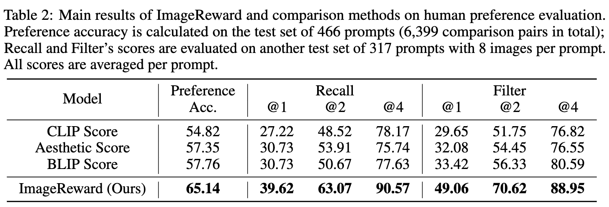

# ImageReward

<p align="center">
   🤗 <a href="https://huggingface.co/THUDM/ImageReward" target="_blank">HF Repo</a> • 🐦 <a href="https://twitter.com/thukeg" target="_blank">Twitter</a> • 📃 <a href="https://arxiv.org/abs/2304.05977" target="_blank">Paper</a> <br>
</p>

**ImageReward: Learning and Evaluating Human Preferences for Text-to-Image Generation**

ImageReward is the first general-purpose text-to-image human preference RM, which is trained on in total **137k pairs of expert comparisons**. 

It outperforms existing text-image scoring methods, such as CLIP (by 38.6%), Aesthetic (by 39.6%), and BLIP (by 31.6%), in terms of understanding human preference in text-to-image synthesis. Try `image-reward` package in only 3 lines of code!

```python
# pip install image-reward
import ImageReward as RM
model = RM.load("ImageReward-v1.0")

rewards = model.score("<prompt>", ["<img1_obj_or_path>", "<img2_obj_or_path>", ...])
```

If you find `ImageReward`'s open-source effort useful, please 🌟 us to encourage our following developement!

<p align="center">
    
</p>

## Quick Start

### Install Dependency

We have integrated the whole repository to a single python package `image-reward`. Following the commands below to prepare the environment:

```shell
# Clone the ImageReward repository (containing data for testing)
git clone https://github.com/THUDM/ImageReward.git
cd ImageReward

# Install the integrated package `image-reward`
pip install image-reward
```

### Example Use

We provide example images in the [`assets/images`](assets/images) directory of this repo. The example prompt is:

```text
a painting of an ocean with clouds and birds, day time, low depth field effect
```

Use the following code to get the human preference scores from ImageReward:

```python
import os
import torch
import ImageReward as RM

if __name__ == "__main__":
    prompt = "a painting of an ocean with clouds and birds, day time, low depth field effect"
    img_prefix = "assets/images"
    generations = [f"{pic_id}.webp" for pic_id in range(1, 5)]
    img_list = [os.path.join(img_prefix, img) for img in generations]
    model = RM.load("ImageReward-v1.0")
    with torch.no_grad():
        ranking, rewards = model.inference_rank(prompt, img_list)
        # Print the result
        print("\nPreference predictions:\n")
        print(f"ranking = {ranking}")
        print(f"rewards = {rewards}")
        for index in range(len(img_list)):
            score = model.score(prompt, img_list[index])
            print(f"{generations[index]:>16s}: {score:.2f}")

```

The output should be like as follow (the exact numbers may be slightly different depending on the compute device):

```
Preference predictions:

ranking = [1, 2, 3, 4]
rewards = [[0.5811622738838196], [0.2745276093482971], [-1.4131819009780884], [-2.029569625854492]]
          1.webp: 0.58
          2.webp: 0.27
          3.webp: -1.41
          4.webp: -2.03
```

## Reproduce Experiments in Table 2

<p align="center">
    
</p>

Run the following script to automatically download data, baseline models, and run experiments:

```bash
bash ./scripts/test.sh
```

If you want to check the raw data files individually:

* Test prompts and corresponding human rankings for images are located in [`data/test.json`](data/test.json). 
* Generated outputs for each prompt (originally from [DiffusionDB](https://github.com/poloclub/diffusiondb)) can be downloaded from [Huggingface](https://huggingface.co/THUDM/ImageReward/blob/main/test_images.zip) or [Tsinghua Cloud](https://cloud.tsinghua.edu.cn/f/9bd245027652422499f4/?dl=1). It should be decompressed to `data/test_images`.

## Reproduce Experiments in Table 4
TODO

## Citation

```
@misc{xu2023imagereward,
      title={ImageReward: Learning and Evaluating Human Preferences for Text-to-Image Generation}, 
      author={Jiazheng Xu and Xiao Liu and Yuchen Wu and Yuxuan Tong and Qinkai Li and Ming Ding and Jie Tang and Yuxiao Dong},
      year={2023},
      eprint={2304.05977},
      archivePrefix={arXiv},
      primaryClass={cs.CV}
}
```
